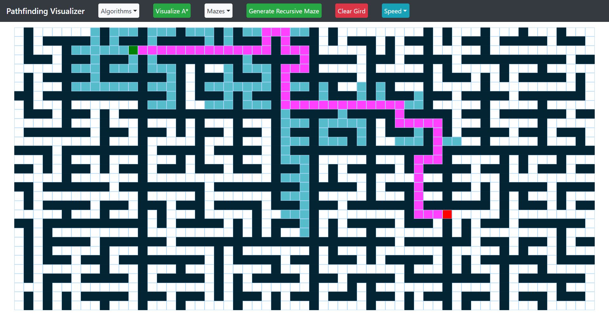

# Pathfinding Visualizer

A React-based web application for visualizing pathfinding algorithms and maze generation. Users can interactively generate mazes, place walls, and watch various pathfinding algorithms find the shortest path from a start node (green) to a finish node (red) on a responsive grid.




## Features

- **Responsive Grid**: Adapts to window size/resolution (up to ~60x100 cells on large screens).
- **Interactive Controls**:
  - Click/drag to toggle walls (black cells).
  - Dropdown menus for algorithm and maze selection.
  - Speed controls: Slow/Medium/Fast for animations.
  - Clear Grid / Clear Path buttons.
- **Visual Feedback**:
  - Visited nodes: Light purple.
  - Shortest path: Bright yellow.
  - Walls: Black.
  - Maze generation: Animated wall placement.
- **No External Setup**: Runs entirely in the browser via Create React App.

## Supported Pathfinding Algorithms

| Algorithm | Description | Guarantees Shortest Path? |
|-----------|-------------|---------------------------|
| **Dijkstra's** | Graph search using edge weights (uniform cost here). | ✅ Yes |
| **A*** | Informed search with heuristic (Manhattan distance). | ✅ Yes (optimal with admissible heuristic) |
| **Greedy Best-First** | Greedy search using heuristic only. | ❌ No |
| **Bidirectional Greedy** | Two simultaneous Greedy searches from start & goal. | ❌ No |
| **Breadth-First Search (BFS)** | Level-order traversal. | ✅ Yes (unweighted) |
| **Depth-First Search (DFS)** | Stack-based recursion. | ❌ No |
| **Random Walk** | Non-deterministic random movement until goal. | ❌ No |

## Supported Maze Generation Algorithms

| Algorithm | Description |
|-----------|-------------|
| **Random Maze** | Probabilistic wall placement avoiding start/finish. |
| **Recursive Division** | Divide-and-conquer: Random horizontal/vertical walls with passages. |
| **Vertical Division** | Primarily vertical walls with passages. |
| **Horizontal Division** | Primarily horizontal walls with passages. |

## Project Structure

```
pathfinding/
├── public/
│   ├── index.html         # App entry HTML
│   └── social-image.PNG   # OG image for sharing
├── src/
│   ├── index.js           # ReactDOM render root
│   ├── index.css          # Global styles
│   ├── pathfindingVisualizer/    # Main app
│   │   ├── pathfindingVisualizer.jsx  # Grid, logic, animation
│   │   ├── navbar.jsx                 # UI controls
│   │   └── Node/node.jsx              # Individual grid cell
│   ├── pathfindingAlgorithms/         # Core algos (e.g. astar.js, dijkstra.js)
│   └── mazeAlgorithms/                # Maze generators (e.g. recursiveDivision.js)
├── package.json          # Dependencies & scripts
└── ... (standard CRA files)
```

## Tech Stack

- **React** (^16.13.1)
- **Bootstrap** (^4.5.2) for navbar/dropdowns
- **Create React App** (react-scripts ^3.4.3)
- Vanilla JS/CSS/JSX (no hooks/classes, functional utils)
- Deployed via **gh-pages**

## Quick Start (Development)

1. **Install Dependencies**:
   ```
   npm install
   ```

2. **Run Locally**:
   ```
   npm start
   ```
   - Opens http://localhost:3000
   - Grid auto-resizes; test algos/mazes.

3. **Build for Production**:
   ```
   npm run build
   ```

4. **Deploy to GitHub Pages** (configured):
   ```
   npm run deploy
   ```

## Usage

1. Select **Algorithm** (e.g., A*) from dropdown → Click **Visualize Algorithm**.
2. (Optional) Select **Maze** → Click **Generate Maze** (animates walls).
3. Drag to add/remove walls.
4. Watch animation: visited → shortest path.
5. Use **Clear Path** (keep walls) or **Clear Grid** (reset all).

**Tips**:
- Resize browser → Grid auto-adjusts.
- Speed affects animation delay (path: ~3x maze).
- Start/finish positions randomized based on grid size.

## Algorithm Details

- **Grid Nodes**: Each `{row, col}` has `distance`, `totalDistance` (f=g+h), `previousNode`, states (`isWall`, `isVisited`, `isShortest`).
- **Animation**: `setTimeout` chains for sequential reveal (speed-controlled).
- **Maze Gen**: Returns wall coords `[[r1,c1], [r2,c2], ...]` (avoids start/finish).
- **Heuristic (A*/Greedy)**: Manhattan `|Δrow| + |Δcol|`.
